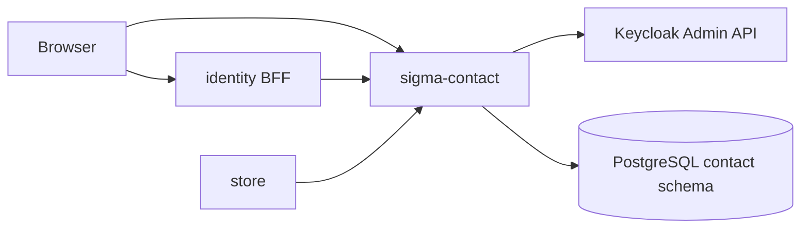

# sigma-contact architecture

`sigma-contact` is the contact directory for Sigma Tactical Group. It stores identity-sourced and manually entered contacts, syncs users from Keycloak, and serves a public storefront contact form protected by human verification.

## Context

This service owns the PostgreSQL `contact` schema and the `contact.contacts` table.

## Runtime shape

The `sigma-contact` binary loads `HumanCheck` from the environment, connects `ContactStore` to PostgreSQL, then hands `sigma_contact::routes(store, human_check)` to `sigma_theme::warp::serve`. The theme crate supplies the Warp server, shared static assets, security headers, and the listen address from `PORT`.

Identity-sourced contacts are read-only through the API; external submissions arrive through the public form.

## Request flow

`routes()` combines the public contact form from `public_contact.rs`, admin web routes from `web.rs`, JSON handlers from `api.rs`, and human-check challenge routes from `sigma_human_check::warp::routes`. `sigma_theme::warp::site_routes` supplies `/up`, static assets, and error recovery.

`GET/POST /contact` serves the storefront form with ALTCHA verification and optional session enrichment from identity. Admin routes list, create, edit, and delete contacts and trigger Keycloak sync. The internal API serves `/contacts` CRUD and `POST /contacts/sync`.

## Code map

| Path | Responsibility |
| --- | --- |
| `src/main.rs` | Loads human-check config, connects the store, and starts the server. |
| `src/lib.rs` | Assembles public form, admin UI, API, human-check, health, and theme routes. |
| `src/config.rs` | Reads public URLs, Keycloak settings, return-uri allowlist, and identity internal URL. |
| `src/store.rs` | Contact persistence. |
| `src/identity.rs` | Keycloak Admin API sync. |
| `src/public_contact.rs` | Public storefront contact form. |
| `src/session_status.rs` | Identity session lookup on form submit. |
| `src/allowlist.rs` | `return_url` validation for the public form. |
| `src/api.rs` | Internal-token JSON API. |
| `src/web.rs` | Admin HTML UI. |
| `src/templates/` | Askama HTML for admin and public pages. |

## Data

PostgreSQL schema `contact` holds contact rows with source metadata distinguishing identity sync from manual and public submissions. Sync updates identity-linked rows without overwriting manually edited fields where the schema preserves that distinction.

## Configuration

| Environment variable | Purpose |
| --- | --- |
| `PORT` | Listen port supplied to the theme crate. |
| `CONTACT_IDENTITY_PUBLIC_URL` | Identity BFF URL for navbar links and CSP `connect-src`. |
| `CONTACT_PUBLIC_BASE_URL` | Public base URL of this contact service. |
| `CONTACT_CART_PUBLIC_URL` | Cart-service URL for the shared chrome. |
| `CONTACT_IDENTITY_ISSUER_URL` | Optional Keycloak issuer URL for identity sync. |
| `CONTACT_IDENTITY_CLIENT_ID` | Optional service-account client id for Keycloak Admin API. |
| `CONTACT_IDENTITY_CLIENT_SECRET` | Optional service-account client secret for Keycloak Admin API. |
| `CONTACT_IDENTITY_INTERNAL_URL` | Cluster-internal identity URL for session status checks on public submit. |
| `CONTACT_RETURN_URIS` | Comma-separated allowed `return_url` values for the public `/contact` form. |
| `DATABASE_URL` | PostgreSQL connection URL for the shared Sigma database. |

## Deployment

`Dockerfile` produces the `sigma-contact` image. The platform deployment is at `../platform/services/contact/base/deployment.yaml`; it exposes container port `8080` through `../platform/services/contact/base/service.yaml` on service port `80`.

The public VirtualService and environment overlays reside beside the base manifests under `../platform/services/contact/`. Production hostname and platform context are documented in [`../platform/README.md`](../platform/README.md).

## Testing

Run `cargo test -p sigma-contact`. Integration tests in `src/lib.rs` use `HumanCheck::disabled()` and cover `/up`, public form behaviour, and admin routes. Tests use `sigma_pg::test_helpers::ready_store`.

## Design notes

- Public form bot protection uses `sigma-human-check` (ALTCHA); configure `HUMAN_CHECK_*` at startup.
- Storefront links to `/contact` with an allowlisted `return_url`.
- Admin UI and JSON API are intended behind the identity BFF proxy in production.
